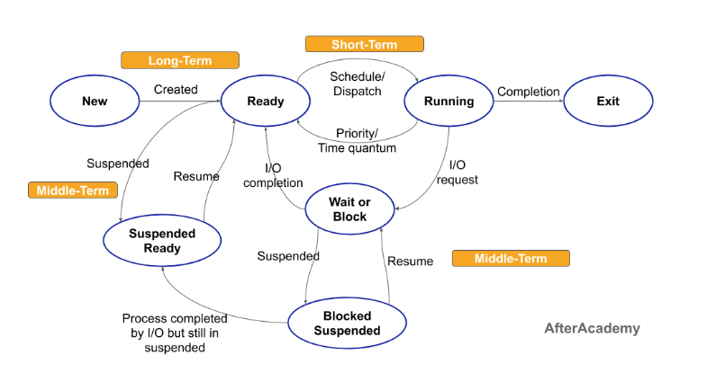

# 🧩 Process State

Every process in an operating system passes through several states during its lifetime.
Each state represents what the process is doing or waiting for.

Here’s the complete list of process states:

| **State**         | **Meaning**                                       |
| ----------------- | ------------------------------------------------- |
| New               | Process is being created                          |
| Ready             | Process is loaded into memory and waiting for CPU |
| Running           | Process is being executed by CPU                  |
| Waiting / Blocked | Process is waiting for an I/O event or resource   |
| Suspended Ready   | Process is ready but swapped out of memory        |
| Suspended Wait    | Process is waiting and swapped out of memory      |
| Terminated        | Process has completed or been killed              |

```
The Operating System keeps track of each process’s current state using a data structure called the Process Control Block (PCB).
```

Have a look at the diagram below for a visual representation of these states and their transitions:



## 🧩 Explanation of Each Process State

### 🟢 NEW State
- A process is in the **new** state when it is being **created**.
- The OS has not yet admitted it to the ready queue.
- Resources (like PCB, memory space) are being allocated.
- The process resides in **secondary memory** at this stage.

➡ **Transition:** `New → Ready` (when admitted by Long-Term Scheduler)

---

### 🟡 READY State
- The process is in **main memory**, waiting for CPU time.
- It’s ready to run as soon as the CPU is available.
- All required resources except CPU are allocated.
- Managed by the **Short-Term Scheduler (CPU Scheduler)**.

---

### 🔵 RUNNING State
- The process is currently being **executed by the CPU**.
- Instructions are being fetched, decoded, and executed.
- Only **one process per CPU core** can be in this state.

➡ **Transitions:**
- `Running → Waiting` if process requests I/O.
- `Running → Ready` if preempted by a higher priority process.
- `Running → Terminated` when execution completes.

---

### 🟠 WAIT / BLOCKED State
- Process is **waiting for an event** (I/O completion, semaphore, user input).
- It **cannot use CPU** until the event finishes.

➡ **Transition:** `Waiting → Ready` (once event completes)

---

### 🔴 TERMINATED State
- The process has **completed execution** or was **killed** by the OS/user.
- All resources are deallocated, and PCB is deleted from memory.

---

### ⚫ SUSPENDED WAIT (Blocked Suspend)
- Many waiting processes can be **swapped to disk** to free main memory.
- Used when system needs more memory or to optimize CPU load.

➡ **Transition:**
- `Wait → Suspended Wait` (swapped out)
- `Suspended Wait → Suspended Ready` (I/O completed, still on disk)

---

### ⚫ SUSPENDED READY
- Similar to suspended wait but process is **ready** and stored on disk.
- **Medium-Term Scheduler** swaps it back to main memory when possible.

➡ **Transitions:**
- `Ready → Suspended Ready` (low memory)
- `Suspended Ready → Ready` (swapped back in)

---

## 🧭 4️⃣ Schedulers and Their Roles

Schedulers decide **which process moves between states**.

| **Scheduler** | **Role** | **Runs Frequency** | **Example Transition** |
|----------------|-----------|--------------------|------------------------|
| Long-Term Scheduler | Admits new processes to ready queue | Infrequently | New → Ready |
| Short-Term Scheduler | Selects process for CPU allocation | Very Frequently | Ready → Running |
| Medium-Term Scheduler | Swaps processes in/out of memory | Occasionally | Ready ↔ Suspended Ready |

---

### 🟩 Long-Term Scheduler (Job Scheduler)
- Decides which processes to admit into ready queue.
- Controls **degree of multiprogramming**.
- Chooses mix of I/O-bound and CPU-bound jobs.

---

### 🟨 Short-Term Scheduler (CPU Scheduler)
- Chooses process for CPU execution.
- Performs **context switching**.
- Handles **Running ↔ Ready ↔ Waiting** transitions.

---

### 🟦 Medium-Term Scheduler (Swapper)
- Handles **swapping** of processes between main and secondary memory.
- Manages **suspended states**.
- Improves CPU performance and memory management.

---

## ⚡ 5️⃣ CPU Scheduling Types

### 🔹 Preemptive Scheduling
- CPU can be **forcibly taken** from a process before it finishes.
- Ensures **responsiveness** and fairness.
- Used in **time-sharing systems**.

**Examples:** Round Robin, SRTF, Preemptive Priority Scheduling.

---

### 🔹 Non-Preemptive Scheduling
- Once CPU is given, process keeps it until it completes or waits voluntarily.
- Simpler but less responsive.

**Examples:** FCFS, SJF.

---

## 🧮 6️⃣ State Transitions and Schedulers

| **Transition** | **Handled By** | **Reason** |
|----------------|----------------|-------------|
| New → Ready | Long-Term Scheduler | Process admitted |
| Ready → Running | Short-Term Scheduler | CPU assigned |
| Running → Waiting | OS / Process | Waiting for I/O |
| Waiting → Ready | OS | I/O complete |
| Running → Terminated | OS | Execution done |
| Ready ↔ Suspended Ready | Medium-Term Scheduler | Memory load management |
| Waiting ↔ Suspended Wait | Medium-Term Scheduler | Memory optimization |

---

## 🧠 7️⃣ Real-Life Example

| **Action** | **Process State** |
|-------------|-------------------|
| Open Chrome | New → Ready |
| Chrome starts loading | Ready → Running |
| Chrome waits for network | Running → Waiting |
| Network resumes | Waiting → Ready → Running |
| Minimize Chrome | Ready → Suspended Ready |
| Close Chrome | Running → Terminated |

---

## 📘 8️⃣ Summary Table

| **State** | **In Memory?** | **Waiting for CPU?** | **Description** |
|------------|----------------|----------------------|------------------|
| New | ❌ | ❌ | Being created |
| Ready | ✅ | ✅ | Ready for CPU |
| Running | ✅ | ❌ | Currently executing |
| Waiting | ✅ | ❌ | Waiting for I/O or event |
| Suspended Ready | ❌ | ✅ | Swapped out, ready |
| Suspended Wait | ❌ | ❌ | Swapped out, waiting |
| Terminated | ❌ | ❌ | Finished execution |

---

## ✅ Final Takeaway

- A **process** is a program under execution.
- **Process state diagram** shows all possible transitions.
- **Schedulers** manage transitions:
  - Long-Term → decides process admission.
  - Medium-Term → manages swapping.
  - Short-Term → allocates CPU.
- **Preemptive scheduling** allows CPU interruption.
- **Non-Preemptive scheduling** lets process finish its turn.

---

