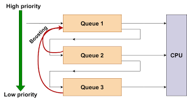

# 🧠 Operating System Notes — CPU Scheduling (Complete Notes)

## 🧩 What is CPU Scheduling?

**CPU Scheduling** is the process by which the **Operating System (OS)** decides which process should run on the CPU at any given time.

Since multiple processes may be in the ready queue, the OS must decide the order of execution to:
- Maximize CPU utilization
- Improve throughput
- Reduce waiting time and response time

---

## 🎯 Objectives of CPU Scheduling

- **Maximize CPU Utilization** → Keep the CPU as busy as possible  
- **Maximize Throughput** → Increase number of processes completed per unit time  
- **Minimize Turnaround Time** → Reduce total time from submission to completion  
- **Minimize Waiting Time** → Reduce idle waiting time in the ready queue  
- **Minimize Response Time** → Improve interactivity in time-sharing systems  
- **Ensure Fairness** → Avoid starvation and ensure equitable CPU sharing  

---

## ⚙️ Types of CPU Scheduling

| Type | Description |
|------|--------------|
| **Preemptive Scheduling** | CPU can be taken away from a process before it finishes (e.g., RR, SRTF) |
| **Non-Preemptive Scheduling** | Once a process gets CPU, it keeps it until completion or it voluntarily releases it (e.g., FCFS, SJF) |

---

## 🧠 Important Terms in CPU Scheduling

| Term | Definition | Formula / Example |
|------|-------------|------------------|
| **Arrival Time (AT)** | Time when process enters ready queue | e.g., P1 arrives at 0 ms |
| **Burst Time (BT)** | Total CPU time required for execution (without waiting time).   It is also known as Execution Time or CPU Burst. | e.g., P1 needs 5 ms CPU |
| **Completion Time (CT)** | The time at which a process finishes its execution and leaves the CPU. | e.g., P1 finishes execution at time = 10 ms, |
| **Turnaround Time (TAT)** | The total time taken by a process from its arrival to its completion.(waiting + execution) | `TAT = CT - AT`  |
| **Waiting Time (WT)** | The total time a process spends waiting in the ready queue before it gets CPU time. | `WT = TAT - BT` |
| **Response Time (RT)** | The time interval between the arrival of a process and the first time it gets the CPU. | `RT = First CPU Start - AT` |

---

## CPU Scheduiling Criteria 

| Criterion           | Description                                     | Desired |
| ------------------- | ----------------------------------------------- | ------- |
| **CPU Utilization** | Percentage of time CPU is busy.                 | High    |
| **Throughput**      | Number of processes completed per unit time.    | High    |
| **Turnaround Time** | Time from submission to completion.             | Low     |
| **Waiting Time**    | Time process spends waiting in the ready queue. | Low     |
| **Response Time**   | Time to start responding.                       | Low     |

### 🧮 Example: FCFS Scheduling (First Come , First Serve)

| Process | Arrival Time (AT) | Burst Time (BT) |
|----------|-------------------|----------------|
| P1 | 0 | 4 |
| P2 | 1 | 3 |
| P3 | 2 | 1 |

**Gantt Chart:**  
`0----4----7----8`  
`P1 → P2 → P3`

| Process | AT | BT | CT | TAT = CT-AT | WT = TAT-BT | RT = Start-AT |
|----------|----|----|----|--------------|--------------|---------------|
| P1 | 0 | 4 | 4 | 4 | 0 | 0 |
| P2 | 1 | 3 | 7 | 6 | 3 | 3 |
| P3 | 2 | 1 | 8 | 6 | 5 | 5 |

---

## 🧾 Types of CPU Scheduling Algorithms

### 1. **First Come First Serve (FCFS)**

**Type:** Non-Preemptive  
**Working:**  
Processes are executed in the order they arrive.

**Advantages:**
- Simple and easy to implement  

**Disadvantages:**
- Convoy effect (short jobs wait behind long jobs)
- Poor for interactive systems

---

### 2. **Shortest Job First (SJF)**

**Type:** Both Preemptive and Non-Preemptive  
**Working:**  
Selects the process with the **shortest burst time** next.

**Advantages:**
- Minimum average waiting time (optimal in theory)

**Disadvantages:**
- Requires prior knowledge of burst time
- May cause starvation of longer jobs

**Preemptive version:** *Shortest Remaining Time First (SRTF)*

---

### 3. **Shortest Remaining Time First (SRTF)**

**Type:** Preemptive  
**Working:**  
If a new process arrives with a smaller burst time than the remaining time of the current one, CPU is preempted.

**Advantages:**
- Improves response for shorter jobs

**Disadvantages:**
- Starvation possible for long processes
- Requires accurate burst time estimation

---

### 4. **Round Robin (RR)**

**Type:** Preemptive  
**Working:**  
Each process gets a fixed **time quantum (Q)** in cyclic order.
If a process doesn’t finish in its time slice, it’s sent back to the ready queue.

**Example:**
- Time Quantum = 4 ms
- Processes: P1(5), P2(8), P3(12)

**Gantt Chart:**  
`P1(4) → P2(4) → P3(4) → P1(1) → P2(4) → P3(8)`

**Advantages:**
- Fair allocation to all processes
- Suitable for time-sharing systems

**Disadvantages:**
- Too small quantum → too many context switches
- Too large quantum → behaves like FCFS

---

### 5. **Priority Scheduling**

**Type:** Preemptive or Non-Preemptive  
**Working:**  
Each process is assigned a **priority number**; CPU is given to the highest priority process.
(Smaller number = higher priority, usually)

**Example:**
| Process | Burst Time | Priority |
|----------|-------------|----------|
| P1 | 10 | 3 |
| P2 | 1 | 1 |
| P3 | 2 | 2 |

**Execution Order:** P2 → P3 → P1

**Disadvantages:**
- Starvation of low-priority processes  
**Solution:** *Aging* — increase priority of waiting processes over time.

---

### 6. **Multilevel Queue Scheduling (MLQ)**

**Type:** Non-Preemptive  
**Concept:**  
The ready queue is divided into **multiple separate queues**, each with its own scheduling algorithm and fixed priority.

Processes are permanently assigned to one queue based on a specific property such as:
- Process type (system, interactive, batch, etc.)
- Priority
- Memory size
- Process privilege level (foreground/background)

**Example Setup:**

| Queue No. | Process Type       | Scheduling Algorithm | Priority |
| --------- | ------------------ | -------------------- | -------- |
| Q1        | System / Real-time | Round Robin (RR)     | Highest  |
| Q2        | Interactive / User | Round Robin (RR)     | Medium   |
| Q3        | Batch / Background | FCFS                 | Lowest   |

    

**Working:**
1. The system maintains multiple ready queues.
2. Each process is assigned permanently to one queue.
3. CPU scheduling is done in two levels:
    - *Between Queues:*  
    A fixed priority is assigned to each queue. Higher-priority queues get the CPU first.       
    (e.g., Q1 > Q2 > Q3)

    - Within a Queue:  
    Each queue uses its own scheduling algorithm.
    (e.g., Q1 uses RR, Q3 uses FCFS)
4. A lower-priority queue gets CPU time only if all higher-priority queues are empty.

**Advantages:**  
- **Rigid**: Processes are permanently assigned to queues — no movement between queues.
- **Starvation**: Low-priority queues may never get CPU if high-priority queues are always busy.
- **Less flexible** compared to modern scheduling models.- Different scheduling policies can be applied to different process groups.

**Disadvantages:**
- Rigid (no movement between queues)
- Starvation possible for low-priority 

### **IMPORTANT TERM :**  
#### **1. System Processes**:   
System processes are kernel-level or background processes that perform essential tasks required by the operating system to function properly.
They are usually managed by the OS and not by users.

➡️ Characteristics:
- High priority (often real-time or near real-time).
- Always running in the background.
- No user interaction.
- Examples: init, systemd, memory manager, device driver, scheduler, etc.

➡️ Example:
- The scheduler itself is a system process.
- The disk manager or file system daemon that handles disk access requests.

🧠 Think of them as the “backbone services” that keep the system alive.

#### **2. Interactive Processes**
Interactive processes are user-driven — they require frequent input and output (I/O) operations and direct interaction with the user.

➡️ Characteristics:
- Need quick responses (low latency).
- Often short CPU bursts followed by I/O waits.
- High priority because users expect responsiveness.
- Examples: text editors, browsers, terminal commands, IDEs, etc.

➡️ Example:
- When you type in a code editor, each keystroke triggers an interactive process that updates the screen immediately.

🧠 Think: “User-facing and response-sensitive.”

#### **3. Batch Processes**

Batch processes are non-interactive — they do not require user input once they start.
They run in the background and complete when their task finishes.

➡️ Characteristics:
- Long-running jobs.
- No need for immediate output.
- Usually scheduled when system load is low.
- Often lower priority than interactive or system processes.
- Examples: backups, compilers, data processing scripts, report generation.

➡️ Example:
- A nightly backup job or a Python script processing large datasets are batch processes.

🧠 Think: “Fire and forget” — runs independently until done.

#### Comparison Summary
| Type of Process         | Description                | Priority  | User Interaction | Example                  |
| ----------------------- | -------------------------- | --------- | ---------------- | ------------------------ |
| **System Process**      | Handles OS-level tasks     | Very High | None             | Scheduler, Device driver |
| **Interactive Process** | Requires user input/output | High      | Frequent         | Text editor, Browser     |
| **Batch Process**       | Runs without user input    | Low       | None             | Backup job, Data script  |

---

### 7. **Multilevel Feedback Queue Scheduling (MLFQ)**

**Type:** Preemptive  
**Concept:**  
Multilevel Feedback Queue Scheduling is an improved and flexible version of MLQ.  
Here, a process can move between queues based on its behavior and execution history.

It dynamically adjusts process priority depending on how much CPU time it has consumed —
- Interactive processes get higher priority,
- CPU-bound processes gradually move to lower queues.

**Main Idea**
- If a process uses too much CPU time, it’s moved to a lower-priority queue.
- If a process waits too long, it’s moved to a higher-priority queue (to prevent starvation).
- Each queue may have its own scheduling algorithm and time quantum.

**Example Setup:**

| Queue | Scheduling | Time Quantum | Priority |
|--------|-------------|---------------|-----------|
| Q1 | Round Robin | 4 ms | Highest |
| Q2 | Round Robin | 8 ms | Medium |
| Q3 | FCFS | — | Lowest |

    

**Working:**
1. New process enters the highest priority queue (Q1).
2. It gets CPU for time quantum = 4 ms.
    -  If it finishes → done ✅
    -  If not → moved to next lower queue (Q2).
3. In Q2, it gets a larger quantum (8 ms).
    -  If it still doesn’t finish → moved to Q3 (FCFS).
4. Long waiting processes can be moved upward (aging) to prevent starvation.

**Advantages:**
- Dynamic and fair  
- Prevents starvation  
- Adaptable (used in modern OS like Linux/Windows)

**Disadvantages:**
- Complex to implement and tune
- Overhead of managing multiple queues

#### **Comparison of MLQ vs MLFQ**

| Feature              | **Multilevel Queue (MLQ)** | **Multilevel Feedback Queue (MLFQ)** |
| -------------------- | -------------------------- | ------------------------------------ |
| **Process Movement** | No (fixed queues)          | Yes (dynamic movement)               |
| **Flexibility**      | Low                        | High                                 |
| **Starvation**       | Possible                   | Avoided (using aging)                |
| **Implementation**   | Simple                     | Complex                              |
| **Scheduling Basis** | Static priority            | Dynamic priority                     |
| **Use Case**         | Simple systems             | Modern OS (Windows, Linux)           |

---

### 8. **Highest Response Ratio Next (HRRN)**

**Type:** Non-Preemptive   

**Concept:**
Highest Response Ratio Next (HRRN) is a non-preemptive CPU scheduling algorithm that selects the process with the highest response ratio for execution next.  

It’s designed to reduce starvation and balance between short and long processes — improving over Shortest Job Next (SJN).   

🧠 The longer a process waits, the higher its RR becomes — meaning old processes get a chance to run soon (avoiding starvation).  

**Formula:**
$$
\text{Response Ratio} = \frac{\text{Waiting Time} + \text{Burst Time}}{\text{Burst Time}}
$$

**Working:**
1. At each scheduling decision point:
    - Calculate Response Ratio (RR) for all ready processes.
    - Choose the process with highest RR.
    
2. Run that process non-preemptively (till completion).
3. Update waiting times and repeat the selection.

**Advantages:**
- Prevents starvation (unlike SJF).
- Balances between short and long processes.
- Gives fair response time for all.

**Disadvantages**
- More complex than FCFS/SJF due to ratio calculation.
- Not preemptive, so a long process can still block short ones temporarily.
- Hard to implement efficiently for large systems.

---

## ⚡ Comparison of Scheduling Algorithms

| Algorithm                     | Type           | Preemptive | Criteria         | Starvation | Suitable For         |
| ----------------------------- | -------------- | ---------- | ---------------- | ---------- | -------------------- |
| **FCFS**                      | Non-Preemptive | ❌          | Arrival Time     | ✅          | Batch Systems        |
| **SJF**                       | Non-Preemptive | ❌          | Burst Time       | ✅          | Batch Systems        |
| **SRTF**                      | Preemptive     | ✅          | Remaining Time   | ✅          | Short Jobs           |
| **Priority**                  | Both           | ✅ / ❌      | Priority         | ✅          | Mixed Systems        |
| **RR**                        | Preemptive     | ✅          | Time Quantum     | ❌          | Time-Sharing Systems |
| **Multilevel Queue**          | Non-Preemptive | ❌          | Queue Type       | ✅          | Mixed Environments   |
| **Multilevel Feedback Queue** | Preemptive     | ✅          | Dynamic Priority | ❌          | General Purpose      |
| **HRRN**                      | Non-Preemptive | ❌          | Response Ratio   | ❌          | Batch & Interactive  |

---

## 🧩 Key Components in Scheduling

| Component | Description |
|------------|--------------|
| **Scheduler** | Decides which process runs next |
| **Dispatcher** | Gives CPU control to chosen process |
| **Context Switch** | Saving/restoring state between process switches |
| **Throughput** | No. of processes completed per unit time |
| **Turnaround Time** | Time between process submission and completion |
| **Waiting Time** | Time spent waiting in the ready queue |
| **Response Time** | Time until first response is produced |

---

## 🧠 Real-World Examples

| OS | Scheduling Type |
|----|------------------|
| **Windows** | Multilevel Feedback Queue |
| **Linux** | Completely Fair Scheduler (CFS) — MLFQ-based |
| **macOS / iOS** | Priority + Feedback Queue |
| **Embedded Systems** | Priority or FCFS |

---

## 🧾 Summary

| Algorithm | Key Feature | Best Use |
|------------|--------------|-----------|
| **FCFS** | Simple, FIFO order | Batch systems |
| **SJF/SRTF** | Optimal waiting time | Short predictable jobs |
| **Priority** | Priority-based | Real-time systems |
| **Round Robin** | Fair CPU time | Interactive systems |
| **MLQ** | Fixed queues | Multi-level workloads |
| **MLFQ** | Dynamic priority | Modern OS |
| **HRRN** | Balances long & short jobs | General systems |

---

## 🧮 Quick Formulas Recap

| Metric | Formula |
|---------|----------|
| Turnaround Time (TAT) | `CT - AT` |
| Waiting Time (WT) | `TAT - BT` |
| Response Time (RT) | `Start Time - AT` |

---

## 🏁 Final Takeaway

- **CPU Scheduling** improves performance and fairness.  
- **Preemptive algorithms** offer responsiveness, while **non-preemptive** ones are simpler.  
- **MLFQ** is the most flexible and widely used scheduling algorithm today.

---
