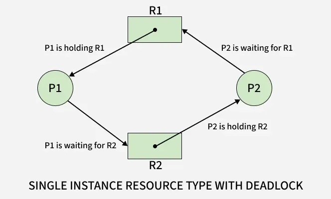

# Deadlock in Operating Systems

---

## 🔹 Definition

A **Deadlock** is a situation in an Operating System where two or more processes are waiting indefinitely for resources held by each other, and hence none of them can proceed.  
It is like a “traffic jam” where every car waits for another to move first.

---

## 🔹 Example

Suppose two processes, P1 and P2, and two resources, R1 and R2:

- P1 holds R1 and waits for R2.
- P2 holds R2 and waits for R1.

Neither can proceed — resulting in a **deadlock**.

### Real-World Analogy

Imagine a single-lane bridge where cars can go only one way at a time:

- Car A enters from the left.
- Car B enters from the right.
- Both meet in the middle.

Neither can move forward (bridge is too narrow), and neither can go backward.  
So both cars wait indefinitely — that’s a **deadlock**!

---

## ⚙️ Conditions for Deadlock (Coffman Conditions)

For a deadlock to occur in a system, **four conditions** must hold simultaneously.  
If any one of these conditions is prevented, deadlock cannot occur.

---

### 🔹 1. Mutual Exclusion

**Meaning:**  
At least one resource must be held in a **non-sharable mode**, meaning only one process can use the resource at a time.  
If another process requests that resource, it must wait until the resource is released.

**Example:**  
A printer can be used by only one process at a time.  
If Process P1 is printing a document, Process P2 must wait until the printer becomes free.

**Prevention Idea:**  
Make resources sharable whenever possible (e.g., read-only files).  
However, some resources like printers or scanners are inherently non-sharable.

---

### 🔹 2. Hold and Wait

**Meaning:**  
A process is holding at least one resource and waiting to acquire additional resources that are currently held by other processes.

**Example:**  
- P1 is holding a printer and waiting for a scanner.
- P2 is holding a scanner and waiting for a printer.

Both are holding one resource and waiting for another — a key cause of deadlock.

**Prevention Idea:**  
- Require processes to request all resources at once before starting execution, or  
- Force them to release all held resources before requesting new ones.

---

### 🔹 3. No Preemption

**Meaning:**  
A resource cannot be forcibly taken from a process; it must be released voluntarily by the process after it completes its task.  
If a process is holding a resource and waiting for another, the system cannot preempt (take back) that resource.

**Example:**  
If a process is using a printer, the OS cannot simply take it away — the process must finish printing and then release it.

**Prevention Idea:**  
Allow preemption of certain resources.  
If a process is waiting, temporarily take away its held resources and give them to others.

---

### 🔹 4. Circular Wait

**Meaning:**  
There exists a set of processes {P1, P2, P3, ..., Pn} such that:

- P1 is waiting for a resource held by P2.
- P2 is waiting for a resource held by P3.
- ...
- Pn is waiting for a resource held by P1.

Thus forming a circular chain of waiting.

**Example:**  
P1 → R1 → P2 → R2 → P1  
Each process waits for a resource held by the next — creating a cycle → Deadlock.

**Prevention Idea:**  
Impose a strict ordering of resource types (e.g., R1 < R2 < R3).  
Processes must request resources in increasing order only, so circular wait can’t occur.

---

### Summary Table

| Condition               | Description                                                                                                | Example                                                              |
|-------------------------|------------------------------------------------------------------------------------------------------------|----------------------------------------------------------------------|
| **1. Mutual Exclusion** | At least one resource must be held in a **non-sharable mode** — only one process can use it at a time.     | A printer can be used by only one process at a time.                 |
| **2. Hold and Wait**    | A process is holding at least one resource and **waiting** to acquire additional resources held by others. | Process P1 holds R1 and waits for R2.                                |
| **3. No Preemption**    | Resources **cannot be forcibly taken** from a process; they must be released voluntarily.                  | A printer cannot be taken from a process until it finishes printing. |
| **4. Circular Wait**    | A set of processes are waiting for each other in a **circular chain**.                                     | P1 waits for R1 (held by P2), and P2 waits for R2 (held by P1).      |

---

## ⚙️ Strategies for Handling Deadlock

In an Operating System, deadlocks can seriously affect system performance by stopping processes indefinitely.  
To manage this, OS designers use **four main strategies** to handle deadlocks.

---

### 🔹 1. Deadlock Prevention

**Idea:**  
Prevent the system from entering a deadlock state by breaking one or more of the four necessary conditions (Coffman conditions):

- Mutual Exclusion
- Hold and Wait
- No Preemption
- Circular Wait

| Broken Condition     | How to Prevent                                                                                                                                     | Example                                                                                     | Problem / Drawback                                                                                                                        |
|----------------------|----------------------------------------------------------------------------------------------------------------------------------------------------|---------------------------------------------------------------------------------------------|-------------------------------------------------------------------------------------------------------------------------------------------|
| **Mutual Exclusion** | Make resources **sharable** whenever possible so that multiple processes can use them simultaneously.                                              | Read-only files can be shared among many processes.                                         | Not all resources are sharable — some (like printers, scanners) must remain non-sharable, so this condition **cannot always be removed**. |
| **Hold and Wait**    | Require each process to **request all required resources at once** before execution, or **release all held resources** before requesting new ones. | A process requests both printer and scanner before starting.                                | Leads to **low resource utilization** (resources stay idle) and **possible starvation** (process may wait long to get all resources).     |
| **No Preemption**    | Allow the system to **take back (preempt)** resources from processes if they are waiting for others.                                               | If a process waits for a resource, the OS preempts its held resources and reallocates them. | **Not applicable to non-preemptible resources** like printers; can cause **process rollback** and **loss of work**.                       |
| **Circular Wait**    | Impose a **strict ordering of resource types** and force processes to request resources in **increasing order** only.                              | Always request resources in order R1 → R2 → R3.                                             | Difficult to **define and maintain a global order** for all resources; may restrict process flexibility and **reduce concurrency**.       |

---

### 🔹 2. Deadlock Avoidance

**Idea:**  
Let deadlock be possible, but avoid it by carefully allocating resources only if it keeps the system in a **safe state**.

A **safe state** means that there exists a sequence of all processes where each can get its resources, execute, and release them.

**Techniques:**  
The system must know in advance the maximum resource requirement of each process.  
Before allocating, the OS checks whether the system will remain safe.

**Algorithm Used:**  
- **Banker’s Algorithm** (by Dijkstra)  
  Works for systems with multiple instances of each resource.  
  Checks if a request can be safely granted without causing deadlock.

**Drawbacks:**  
- Needs prior knowledge of maximum resource requirements.
- Computationally expensive for large systems.
- Not suitable for systems with unpredictable resource needs.

---

### 🔹 3. Deadlock Detection and Recovery

**Idea:**  
Let deadlock occur, but have the system detect it and recover afterward.

#### 🔸 Detection:

The system periodically checks for deadlocks using:

- **Resource Allocation Graph (RAG)** for single-instance resources.
- **Detection Algorithm** (using matrices like Allocation, Request, and Available) for multiple instances.

If a cycle is found in the graph ⇒ Deadlock exists.

#### 🔸 Recovery Methods:

**a) Process Termination**  
- Abort all deadlocked processes.  
- Or abort one process at a time until the deadlock is resolved.

**b) Resource Preemption**  
- Temporarily take resources from some processes and give them to others.  
- Process is resumed later when resources are available.

**Issues:**  
- **Rollback:** Process must return to a safe state.  
- **Starvation:** Same process may be chosen repeatedly.

---

### 🔹 4. Deadlock Ignorance (Ostrich Algorithm)

**Idea:**  
Ignore the problem altogether and assume deadlocks never happen.

**Why "Ostrich Algorithm"?**  
Like an ostrich burying its head in the sand — the OS simply “pretends” deadlocks don’t exist.

**Used In:**  
- Windows, UNIX, Linux systems.  
- Because deadlocks are rare, and detection/prevention is expensive.

**Advantages:**  
- No performance overhead.  
- Simplifies OS design.

**Disadvantages:**  
- If a deadlock actually occurs, the system may freeze or require restart.

---

### 🔹 Comparison Table

| Strategy                 | Approach                              | Example                       | Overhead | Used In            |
|--------------------------|---------------------------------------|-------------------------------|----------|--------------------|
| **Prevention**           | Break at least one deadlock condition | Request all resources at once | Medium   | Embedded systems   |
| **Avoidance**            | Check system safety before allocation | Banker’s Algorithm            | High     | Real-time systems  |
| **Detection & Recovery** | Detect cycle, then resolve            | Resource Allocation Graph     | High     | Batch systems      |
| **Ignorance**            | Assume deadlock won’t occur           | Windows, Linux                | Low      | General-purpose OS |

---

## 🧩 Resource Allocation Graph (RAG) - DeadLock detection Graph Method

### ⚙️ Definition:

A Resource Allocation Graph is a directed graph used to represent the state of resource allocation in a system.  
It helps in detecting, analyzing, and understanding possible deadlocks.

### 🧱 Components of RAG

There are two types of nodes and two types of edges:

| Symbol            | Type                            | Meaning                                                      |
|-------------------|---------------------------------|--------------------------------------------------------------|
| **P1, P2, P3...** | **Process nodes (circles)**     | Represent processes in the system.                           |
| **R1, R2, R3...** | **Resource nodes (rectangles)** | Represent resource types (each may have multiple instances). |

Each resource node may have dots inside representing the number of instances of that resource.

### 🔁 Edges in RAG

| Edge Type           | Representation                          | Meaning                                               |
|---------------------|-----------------------------------------|-------------------------------------------------------|
| **Request Edge**    | From **process → resource** (`Pi → Rj`) | Process `Pi` is **requesting** resource `Rj`.         |
| **Assignment Edge** | From **resource → process** (`Rj → Pi`) | An instance of `Rj` is **allocated** to process `Pi`. |

<h3 align="center">Resource Allocation Graph (RAG)</h3>
<p align="center">
  
</p>

---

<h3 align="center">Single Instance Resource Type – Deadlock Example</h3>
<p align="center">
  
</p>

---

<h3 align="center">Multiple Instance Resource Type – Cycle Exists but No Deadlock</h3>
<p align="center">
  
</p>


✅ In short:
```
A Resource Allocation Graph (RAG) is a visual tool used by the operating system to check if the current allocation of resources can lead to deadlock.  
If there’s a cycle in the graph (for single-instance resources), deadlock definitely exists.  
For multiple-instance resources, a cycle may indicate potential deadlock, requiring further analysis using brnker's algorithm , and other detection methods.
```

---

## 🏦 Banker’s Algorithm — Operating System

### ✔️ Definition

Banker’s Algorithm is a **deadlock avoidance algorithm** used in Operating Systems.  
It checks every resource request and decides whether granting it will keep the system **safe** or may lead to **deadlock**.

It was proposed by Edsger Dijkstra, inspired by how a banker loans money:

- A banker never gives loans that cannot be repaid eventually.
- Similarly, OS never gives resources if doing so might cause deadlock.

---

### 🎯 Purpose of Banker’s Algorithm

- To avoid deadlocks, not detect or handle them later.
- To check if the system is in a **safe state**.
- To ensure resources are given only if the system will remain safe afterward.

---

### 🧩 Key Concepts

Before understanding the algorithm, you must understand **three important matrices**:

1️⃣ **Max Matrix**  
Shows the **maximum demand** of each process.  
Example: P1 may need at most 7 units.

2️⃣ **Allocation Matrix**  
Shows how many resources each process currently **holds**.

3️⃣ **Need Matrix**  
Shows how many more resources each process **still needs**:  
```
Need = Max − Allocation
```

4️⃣ **Available Vector**  
Tells how many resources are currently **free**.

---

### 🧠 What is a Safe State?

A system is in a **safe state** if:  
- There exists at least one sequence of processes where each process can get its needed resources and finish.

This sequence is called the **safe sequence**.

If no such sequence exists → system is in an **unsafe state**.

**⚠️ Note:**  
Unsafe state **≠** Deadlock.  
Unsafe only means deadlock may occur in the future.

---

### 🏦 Banker’s Algorithm Workflow

Whenever a process requests some resources, the OS does the following:

1. **Check if `Request ≤ Need`**  
   If false → Error (process asked for more than its declared maximum).

2. **Check if `Request ≤ Available`**  
   If false → Process must wait.

3. **Pretend Allocation (Trial Run)**  
   - Reduce `Available`.  
   - Increase `Allocation`.  
   - Reduce `Need`.

4. **Check Safe State**  
   Using the Safety Algorithm:  
   - Find a process whose `Need ≤ Available`.  
   - Simulate finishing → release resources.  
   - Repeat for all processes.

5. **Final Decision**  
   - If **SAFE** → Permanently allocate.  
   - If **UNSAFE** → Rollback and make the process wait.

---

### ⭐ In Simple Layman Language

Imagine:  
- **Bank** → Resources.  
- **Customers** → Processes.  
- **Max loan limit** → Max.  
- **Current loan** → Allocation.  
- **New loan request** → Request.


Example: 
- A bank has EUR (resource units) to give.
- Every customer (process) has a maximum loan limit (Max).
- They already took some loan (Allocation).
- They may request more loan (Request).
- The bank checks if giving this loan will leave the bank capable of fulfilling all customers in the future.

If yes → loan is given.
If no → customer must wait.

The bank gives the loan only if:  
- After giving it, all customers can still be satisfied eventually.
Just like a banker avoids bankruptcy, OS avoids deadlock.

The OS does the same to avoid deadlock.

---

### 📌 Why is it Called Banker’s Algorithm?

Because:  
- A banker ensures the bank never sinks by giving loans carefully.  
- Similarly, OS ensures the system never deadlocks by allocating resources carefully.

---

### 🧪 Mini Example (Simple)

#### Given:
- Total Resources = **10**
- P1: max 7, allocated 5  
- P2: max 3, allocated 2  

Available = 10 − (5 + 2) = **3**

#### P1 requests **2** units

**Check:**
- `Request ≤ Need`? → 2 ≤ (7−5)=2 ✔️  
- `Request ≤ Available`? → 2 ≤ 3 ✔️  

**Trial state:**
- Available = 3 − 2 = **1**
- Allocation[P1] = 7  
- Need[P1] = 0  

**Safety check:**
- P1 finishes → releases 7 → Available = 8  
- P2 finishes → Safe sequence exists  

**Result:** Safe → **Grant request**

---

### ✔️ Advantages

- Guarantees **no deadlock**.
- Works well when max resource needs are known.
- Efficient for small systems.

---

### ❌ Disadvantages

- Requires maximum claim in advance.  
- Not suitable for dynamic/unpredictable systems.  
- Computationally expensive for large systems.  
- Can cause **starvation**.

---

### 🧭 Summary

| Concept            | Meaning                                           |
|--------------------|---------------------------------------------------|
| **Deadlock Avoidance** | Prevent deadlock by checking future possibilities. |
| **Banker’s Algorithm** | Checks each request and ensures system stays safe. |
| **Safe State**     | A sequence exists for all processes to finish.    |
| **Unsafe State**   | No guaranteed finish → Possible future deadlock.  |
| **Key Matrices**   | Max, Allocation, Need, Available.                 |


---
## Deadlock Prevention – Resource Requirement Formulas  


## ✅ QUESTION 1
If there are **p processes** and each process requires **k units** of a single resource type, what is the **minimum number of resource units (R)** required so that deadlock can never occur?

### ✅ Final Answer
```
R_min = p(k − 1) + 1
```
---

### 🔍 Short Proof
- Worst-case deadlock happens when every process holds the maximum amount it can hold without finishing, which is k − 1 units.
- Total units held in this stuck state:
𝑝 = p(k−1)
- If the system has only this many resources, there will be 0 free units, so every process is waiting → deadlock.
- Add just 1 extra unit, and now:
    - At least one process can get that unit,
    - That process finishes and releases all its resources,
    - Others can continue → no deadlock ever possible.

Thus: R_min = p(k − 1) + 1

---

### 🧠 Layman Explanation

Imagine:
- Each person (process) needs 2 bottles of water (k).
- But each person currently has 1 bottle (k − 1) and is waiting for 1 more.
- If you have only enough bottles for everyone to hold 1 each → everyone is stuck forever.  
<br>

But if you have just one extra bottle:
- Give it to one person,
- That person finishes drinking (finishes execution),
- Returns both bottles,
- Others now get their turn.
- So one extra bottle breaks the deadlock.

---

## ✅ QUESTION 2

If each process requires a **different maximum number** of resource units: max₁, max₂, …, maxₚ  
What is the minimum R required to ensure deadlock never occurs?

### ✅ Final Answer
R_min = Σ(maxᵢ − 1) + 1

---

### 🔍 Short Proof

- Each process i can hold maxᵢ − 1 resources and still wait.
- Worst-case stuck state uses Σ(maxᵢ − 1) resources.
- Add 1 extra → at least one finishes → releases → no deadlock.

---

### 🧠 Layman Explanation

Think of each person needing a different number of bottles:
- Person 1 needs 5
- Person 2 needs 3
- Person 3 needs 7  
        (etc.)

Each person might be holding one less than they need and waiting for the last one.  
If the total bottles are exactly equal to this scenario → everyone is stuck.  

But if you add just 1 extra bottle, one person finishes first, returns all bottles, and the system moves without getting stuck.

---

## ✅ QUESTION 3

Given **R resources** and each process needing up to **k units**, what is the **maximum number of processes (p_max)** that never leads to deadlock?

### ✅ Final Answer
p_max = ⌊ (R − 1) / (k − 1) ⌋

---

### 🔍 Short Proof

From Q1: R_min = p(k − 1) + 1  
Solve: p ≤ (R − 1) / (k − 1)  
So: p_max = floor((R − 1)/(k − 1))

---

### 🧠 Layman Explanation

Suppose:
- Each person needs k bottles,
- And you have R bottles total.

To avoid deadlock, each person may hold (k−1) bottles and still be waiting.  
So we divide the total bottles R into chunks of (k−1):

`How many people can each hold (k−1) bottles?`


But you must keep 1 bottle extra to break deadlock.  
**So the formula takes (R−1) and divides by (k−1).**

The floor ensures only whole people count.

---


## 🎯 Final Summary of All Three Formulas

| Scenario                                                            | Formula                  |
|---------------------------------------------------------------------|--------------------------|
| Minimum R for p processes needing k units                           | **R = p(k−1) + 1**       |
| Minimum R when each process needs different max_i                   | **R = Σ(maxᵢ − 1) + 1**  |
| Maximum processes supported with R resources and each needs k units | **pₘₐₓ = ⌊(R−1)/(k−1)⌋** |

---

## ⭐ Starvation (Indefinite Blocking) — Operating System

### ✔️ Definition

**Starvation** (also called indefinite blocking) occurs when a process is continuously denied the required resources to execute, even though those resources are available in the system.  
As a result, the process waits for an indefinitely long time.

### 🧠 Why Does Starvation Happen?

Starvation happens when the OS scheduling or resource allocation policy is unfair or biased.

Common reasons:

1️⃣ **Low-priority processes**

If the scheduler always prefers higher-priority processes:
- High-priority processes keep getting CPU
- Low-priority process never gets a chance → starvation

<br>

2️⃣ **Resource Hogging**

A resource is always used by certain processes, leaving no chance for others.

<br> 

3️⃣ **Unfair resource allocation**

Certain processes get more preference due to:

- Priority queues
- Non-preemptive scheduling
- Long queues
- Continuous arrival of higher-priority jobs

### 🧩 Example of Starvation

**Example 1:** Priority Scheduling

Suppose we use strict priority scheduling:
- P1 → High priority
- P2 → Medium priority
- P3 → Low priority

If processes with high and medium priority keep coming, then P3 may never get CPU.

This is classic starvation.

**Example 2:** Dining Philosophers Problem

Some philosophers may never get both forks and stay hungry forever → starvation.

### ❗ Difference: Starvation vs Deadlock

| Feature      | Starvation                                              | Deadlock                                                      |
| ------------ | ------------------------------------------------------- | ------------------------------------------------------------- |
| Definition   | Process waits indefinitely due to **unfair scheduling** | Two or more processes wait for each other forming a **cycle** |
| System State | System is running                                       | System is stuck                                               |
| Resources    | Resources may be free but not allocated                 | Resources are held in a circular wait                         |
| Recovery     | Use **fair scheduling**                                 | Use deadlock detection/prevention                             |
