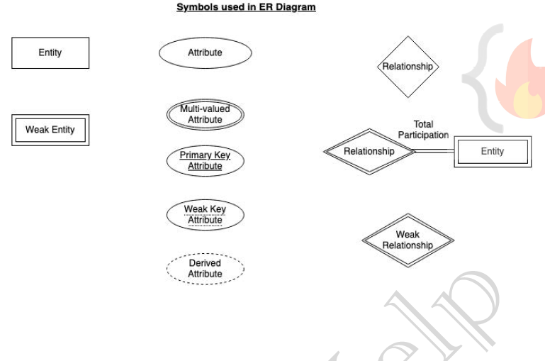

**Data Model**: Collection of conceptual tools for describing data, data relationships, data semantics, and consistency
constraints.

## ⭐ Entity–Relationship (ER) Model

The ER Model (Entity–Relationship Model) is a conceptual data model used to design and represent the structure of a database.  
     
It shows:
- Entities (things)
- Attributes (properties of things)
- Relationships (how entities are connected)
- This model is usually represented using an ER Diagram (ERD).

---

## ⭐ ENTITY–RELATIONSHIP (ER) MODEL

The **ER Model** is a way to visually design a database using:
- **Entities** (things),
- **Attributes** (details of things), and
- **Relationships** (how things are connected).

It helps in converting real-world data into a database structure.

---

### 🔹 1. ENTITY
An **entity** is any real-world object that can be identified clearly.

#### Examples
- Student, Teacher, Car, Hospital, Order, Product.

--- 

#### **ENTITY SET**
An **entity set** is a collection of similar entities.

#### Examples
- All students → **STUDENT** entity set.
- All employees → **EMPLOYEE** entity set.

--- 

#### **TYPES OF ENTITIES**

#### a) Strong Entity
- Has a **primary key** (unique attribute).
- Does not depend on other entities.

**Example:**
```
Student(id, name, age)
```
"Student" is strong because `id` uniquely identifies each student.

**ER Notation:** Rectangle.


#### b) Weak Entity
- Cannot be uniquely identified by its attributes alone.
- Depends on a **strong entity**.
- Has a **partial key** (dashed underline).

**Example:**
```
Dependent(name, age) depends on Employee.
```
Many employees may have dependents named “Rahul”.

**ER Notation:**
- Double rectangle for weak entity.
- Double diamond for weak relationship.

---

### 🔹 2. ATTRIBUTES

**Attributes** are properties of an entity.

#### Types of Attributes

1. **Simple Attribute**
   - Cannot be divided further.  
   **Example:** Age, Roll_no.

2. **Composite Attribute**
   - Can be divided into sub-parts.  
   **Example:** Address → Street, City, Pincode.

3. **Single-Valued Attribute**
   - Holds one value.  
   **Example:** A student has one Aadhaar number.

4. **Multi-Valued Attribute**
   - Holds multiple values.  
   **Example:** Student phone numbers = {98762, 88721}.  
   **Notation:** Double oval.

5. **Derived Attribute**
   - Value can be calculated from another attribute.  
   **Example:** Age can be derived from Date_of_birth.  
   **Notation:** Dashed oval.

6. **Null Values**
   - Null means:
     - Value unknown,
     - Not applicable, or
     - Missing.  
   **Example:** Apartment_no may be NULL if a person lives in a house.

---

### 🔹 3. RELATIONSHIPS

#### Definition
A **relationship** shows how two entities are connected.

#### Examples
- Student enrolls in Course.
- Teacher teaches Subject.

**ER Notation:** Diamond shape.

---

#### **TYPES OF RELATIONSHIPS**

1. **Strong (Identifying) Relationship**
   - Connects strong entities.  
   **Notation:** Normal diamond.

2. **Weak (Non-identifying) Relationship**
   - Connects weak entity → depends on strong entity.  
   **Notation:** Double diamond.

---

#### **DEGREE OF RELATIONSHIP**

**Degree** = Number of entity sets in a relationship.

| **Degree**   | **Meaning**                  | **Example**                                   |
|--------------|------------------------------|-----------------------------------------------|
| **Unary (1)**| Relationship with itself     | Employee supervises Employee.                |
| **Binary (2)**| Between two entities         | Student – Enroll – Course.                   |
| **Ternary (3)**| Three entities              | Supplier – Supplies – Product through Warehouse. |

---

### 🔹 4. RELATIONSHIP CONSTRAINTS

These tell how many entities can participate.

#### A) Mapping Cardinality

1. **One-to-One (1:1)**  
   - One entity ↔ one entity.  
   **Example:** Each student has one ID card.

2. **One-to-Many (1:N)**  
   - One entity is related to many others.  
   **Example:** One teacher teaches many students.

3. **Many-to-One (N:1)**  
   - Many entities relate to one.  
   **Example:** Many employees work in one department.

4. **Many-to-Many (M:N)**  
   - Many entities relate to many.  
   **Example:** Students can enroll in many courses; Courses have many students.

---

#### B) Participation Constraints

1. **Total Participation**
   - Entity must participate.  
   **Notation:** Double line.  
   **Example:** Every employee must be part of a department.

2. **Partial Participation**
   - Entity may or may not participate.  
   **Notation:** Single line.  
   **Example:** Not every employee must have a project.

---

### 🔹 5. ER NOTATIONS (SUMMARY)

| **Component**          | **Notation**          |
|-------------------------|-----------------------|
| **Strong Entity**       | Rectangle             |
| **Weak Entity**         | Double rectangle      |
| **Relationship**        | Diamond               |
| **Weak relationship**   | Double diamond        |
| **Attribute**           | Oval                  |
| **Derived Attribute**   | Dashed oval           |
| **Multi-valued Attribute** | Double oval         |
| **Entity Set**          | Rectangle             |
| **Primary key attribute** | Underlined          |
| **Partial key**         | Dashed underline      |


<br>
<p align="center">
  
  <br>
  <em>Figure 1: ER Notation</em>
</p>

### ⭐ SHORT SUMMARY (Very Easy Remembering)

- **Entity** → Real-world object.  
- **Entity Set** → Group of similar entities.  
- **Attribute** → Property.  
- **Weak Entity** → Depends on strong entity.  
- **Derived Attribute** → Computed.  
- **Relationship** → Shows connection.  
- **Degree** → Number of entities in relationship.  
- **Cardinality** → (1:1, 1:N, N:1, M:N).  
- **Participation** → Total or Partial.

---

