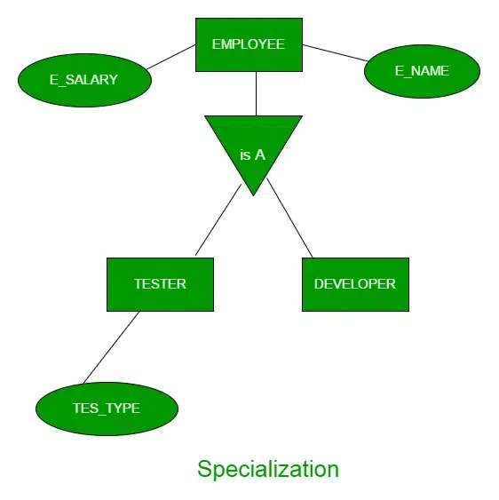
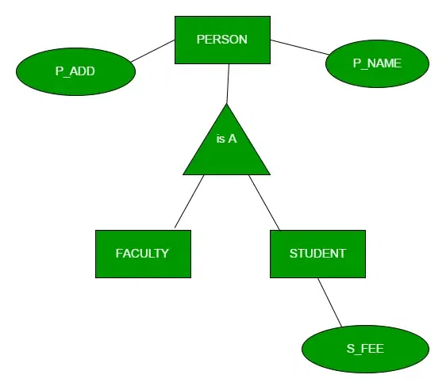
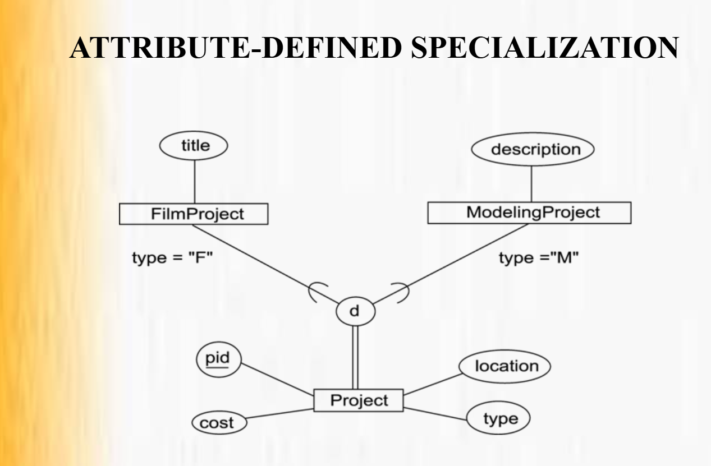
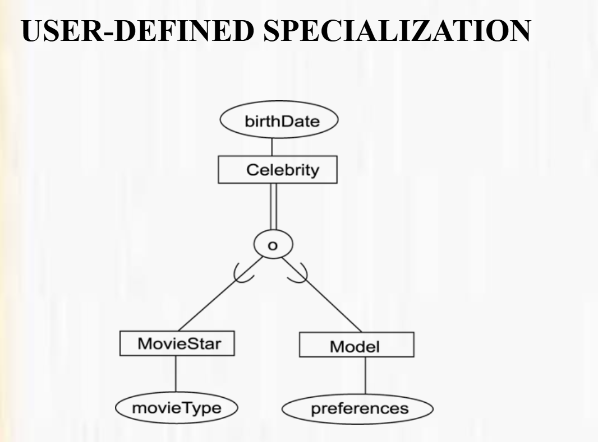
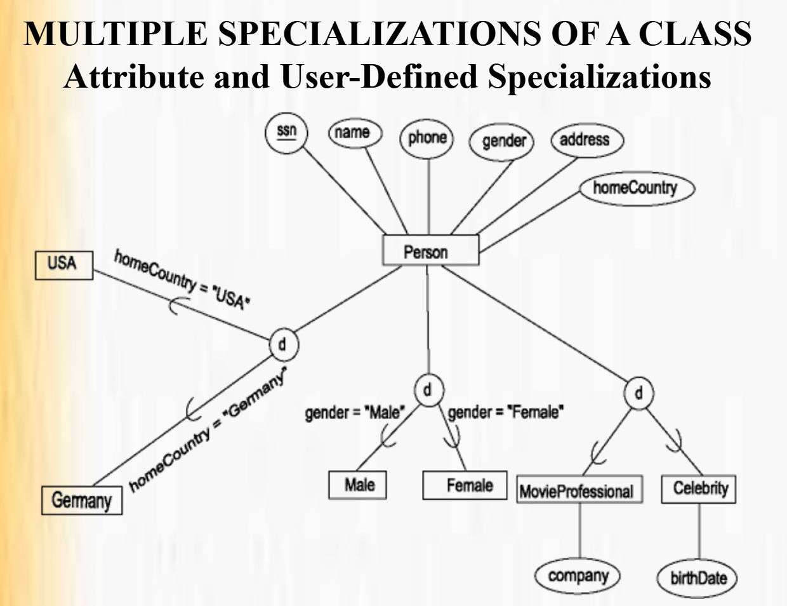
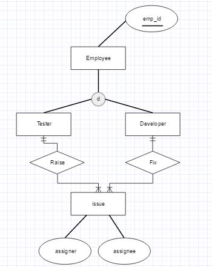

## Extended ER (EER) Model – Explained Simply

The Extended Entity–Relationship (EER) model enhances the basic ER model to represent more complex, real-world database scenarios. It is especially useful when dealing with inheritance, specialization, and complex constraints.


## 1️⃣ Specialization

Specialisation is a top-down approach in EER model where a superclass entity is divided into multiple subclasses based on their distinct features and functionalities, connected through an IS-A relationship.

Key Points 
- Specialisation = Top-Down
- One entity → many sub-entities
- Uses IS-A relationship
- Shown using triangle
- Improves clarity and design


We start from a higher-level (general) entity. Then break it into lower-level (specific) entities. That’s why Specialisation is called a Top-Down approach

<br>
<p align="center">
  
  <br>
  <em>Figure 4: Specialization Relationship</em>
</p>


🔗 “IS-A” Relationship

Specialisation uses IS-A relationship

Means:
    developer IS A employee
    tester IS A employee

✔ This shows inheritance


🔺 Notation (Diagram Representation)

Specialisation is represented by:
- Triangle symbol
- Triangle points from superclass to subclasses

Called ISA triangle


## 2️⃣ Generalization
Generalization is a bottom-up approach in EER model where multiple entity sets with common attributes are combined into a single superclass using an IS-A relationship.


Key Points

Generalization = Bottom-Up

Many entities → One entity

Uses IS-A relationship

Represented by triangle

Removes redundancy


We start from lower-level (specific) entities. Merge them into a higher-level (general) entity. That’s why Generalization is called a Bottom-Up approach

<br>
<p align="center">
  
  <br>
  <em>Figure 4: Specialization Relationship</em>
</p>

🔗 “IS-A” Relationship

Generalization also uses IS-A relationship

Means:
- Student IS A Person
- Faculty IS A Person

✔ Shows inheritance


🔺 Notation (Diagram Representation)

Represented using:

Triangle symbol

Triangle connects subclasses to superclass

Same notation as specialization (direction differs)


### Difference Between Specialization and Generalization


| Basis       | Specialization              | Generalization             |
| ----------- | --------------------------- | -------------------------- |
| Approach    | Top-down                    | Bottom-up                  |
| Starts from | Superclass                  | Subclasses                 |
| Action      | Divide                      | Combine                    |
| Focus       | Differences                 | Similarities               |
| Used when   | Requirements already common | Entities already separate  |
| Example     | Person → Student, Employee  | Student, Employee → Person |


# Constraints on Specialization and Generalization

# 4️⃣ Disjointness Constraint
Disjointness constraint specifies whether an entity of a superclass can belong to only one subclass or multiple subclasses at the same time.

a. Disjoint constraint
b. Overlapping constraint

🧠 Core Idea 
Disjoint → Only one subclass
Overlapping → More than one subclass

## 3️⃣ Disjoint Constraint
An entity can belong to ONLY ONE subclass.
- No overlap allowed
- Mutually exclusive subclasses
- Denoted by d in EER diagrams

📌 Example
```
Employee
 ├── Permanent
 └── Contract
```

👉 One employee cannot be both Permanent and Contract
👉 Must be either one

How it is shown:

Draw a circle (or specialization connector)

Write d inside the circle

Connect superclass → circle → subclasses


2️⃣ Overlapping Constraint (For Comparison)
✔ Meaning

An entity can belong to multiple subclasses.

Overlap allowed

Denoted by o

📌 Example
Person
 ├── Teacher
 └── Researcher


👉 A person can be both Teacher AND Researcher


How it is shown:

Draw a circle

Write o inside the circle

Connect superclass → circle → subclasses


🔑 Why Do We Need Disjointness Constraint?

This is very important 👇

1️⃣ To Represent Real-World Rules Correctly

Real systems have business rules.

Example:

Bank rule: One account is either Savings or Current

❌ Without disjointness, DB may allow invalid data


## 5️⃣ Completeness Constraint

Completeness constraint specifies whether every entity of a superclass must belong to at least one subclass or not.

In very simple words 👇
👉 It answers this question:
“Is it compulsory for an entity to be part of some subclass?”

🧠 Core Idea (Easy to Remember)

Total completeness → Must belong

Partial completeness → May or may not belong

1️⃣ Total Completeness (Total Specialization)
✔ Meaning

Every entity of the superclass MUST belong to at least one subclass.

No entity is left unclassified

Mandatory participation


🔺 Notation (Very Important)

Shown using double line (||)

Drawn between superclass and specialization circle

📌 Example
Employee
 ├── Permanent
 └── Contract


👉 Every employee is either Permanent or Contract
👉 No employee exists outside these subclasses

✔ This is Total Completeness

🧠 Real-Life Examples

Every bank account is either Savings or Current

Every vehicle is Car, Bike, or Bus

Every exam result is Pass or Fail


Partial Completeness Constraint (Partial Specialization)
✔ Meaning

Some entities of the superclass may NOT belong to any subclass.

Participation is optional

Some entities remain only in the superclass

🔺 Notation

Shown using single line (|)

📌 Example
Person
 ├── Student
 └── Employee


👉 Some persons may be:

Student

Employee

Neither (child, retired, unemployed)

✔ This is Partial Completeness

🔑 Why Do We Need Completeness Constraint?
2️⃣ To Avoid Missing or Invalid Data

Total completeness ensures no entity is left undefined

Partial completeness allows flexibility


🔁 Disjointness vs Completeness (Quick Contrast)

| Constraint   | Answers                               |
| ------------ | ------------------------------------- |
| Disjointness | Can entity be in multiple subclasses? |
| Completeness | Must entity be in a subclass?         |


## CONSTRAINTS ON SUBCLASS MEMBERSHIP

A specialization can be:

· Attribute-defined - Determines membership in a subclass by
placing a condition on the value of an attribute in the
superclass.

👉 The database does not ask the user which subclass to join.
👉 The attribute value itself decides.

<br>
<p align="center">
  
  <br>
  <em>Figure 4: Attribute-defined specialization</em>
</p>


· User-defined - Membership in a subclass does not depend on
any specific attribute value. Membership is determined by
the user.

👉 The database cannot decide automatically
👉 User or application logic decides

<br>
<p align="center">
  
  <br>
  <em>Figure 4: User-defined specialization</em>
</p>

Rules : 
- if ever done ramp walk -> Model 
- if ever done movie     -> MovieStar

👉 No single attribute like CelebrityType exists
👉 Decision depends on conditions


RULES FOR USE OF ATTRIBUTE-DEFINED SUBCLASSES

| Condition               | Result                       |
| ----------------------- | ---------------------------- |
| Single-valued attribute | Disjoint subclasses          |
| Multi-valued attribute  | Overlapping subclasses       |
| Total specialization    | Attribute value mandatory    |
| Partial specialization  | Attribute value optional     |
| Attribute present       | Automatic subclass insertion |

🔚 Final Takeaway

Attribute-defined constraints provide automatic, value-based classification, while user-defined constraints allow flexible, rule-based classification when real-world logic is complex.

EXAMPLE : 
<br>
<p align="center">
  
  <br>
  <em>Figure 4: Multiple Specializations of a Class Attributes and User-Defined Specializations</em>
</p>


## Multiple Inheritance

Multiple inheritance occurs when a subclass inherits attributes and relationships from more than one superclass.

In simple words 👇
👉 One child, multiple parents

<br>
<p align="center">
  
  <br>
  <em>Figure 4: Multiple Inheritance</em>
</p>


⚠️ Important Issues in Multiple Inheritance

1️⃣ Attribute Conflict
If both superclasses have same attribute name:
Which one to inherit?

2️⃣ Complexity
Harder to design and implement in DB tables


🔚 Final Takeaway
Inheritance simplifies design by sharing common properties, while multiple inheritance allows richer modeling but increases complexity and must be used carefully.


## 🔒 Constraints on Categorization

Categorization is an EER concept where a subclass (category) is formed from the union of two or more superclasses.

👉 The relationship is OR, not AND.
👉 An entity in the category must come from any one (or more) of the superclasses.


## 6️⃣ Aggregation


