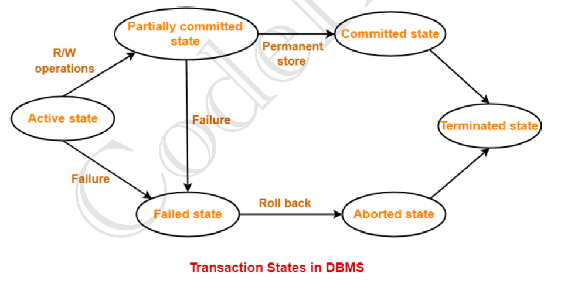

# ⭐ Transaction in DBMS

---

## Table of Contents
- [What is a Transaction?](#what-is-a-transaction)
- [Why Transactions are Important?](#why-transactions-are-important)
- [ACID Properties of Transactions](#acid-properties-of-transactions)
  - [1️⃣ Atomicity](#1️⃣-atomicity)
  - [2️⃣ Consistency](#2️⃣-consistency)
  - [3️⃣ Isolation](#3️⃣-isolation)
  - [4️⃣ Durability](#4️⃣-durability)
- [Transaction States in DBMS](#transaction-states-in-dbms)
  - [1️⃣ Active State](#1️⃣-active-state)
  - [2️⃣ Partially Committed State](#2️⃣-partially-committed-state)
  - [3️⃣ Committed State](#3️⃣-committed-state)
  - [4️⃣ Failed State](#4️⃣-failed-state)
  - [5️⃣ Aborted State](#5️⃣-aborted-state)
  - [6️⃣ Terminated State](#6️⃣-terminated-state)
- [Transaction State Flow](#transaction-state-flow)
- [Summary Tables](#summary-tables)

---

## What is a Transaction?

A **transaction** is a single logical unit of work that performs one or more operations on a database.

👉 A transaction is either **fully completed** or **not done at all**.

---

### Simple Example (Bank Transfer)

Transfer ₹5,000 from **Account A → Account B**.

#### Steps:
1. Read balance of Account A.  
2. Deduct ₹5,000 from Account A.  
3. Add ₹5,000 to Account B.  
4. Save changes.

👉 All these steps together form **one transaction**.  
If any step fails, the entire transaction is **canceled**.

```sql
BEGIN TRANSACTION;
UPDATE account SET balance = balance - 5000 WHERE acc_no = 'A';
UPDATE account SET balance = balance + 5000 WHERE acc_no = 'B';
COMMIT;
```

---

## Why Transactions are Important?

Transactions ensure:
1. **Data consistency**.  
2. **Data accuracy**.  
3. **Safety during system crash**.  
4. **Reliable multi-user access**.

---

## ACID Properties of Transactions

**ACID** is a set of four rules that guarantee that database transactions are processed safely and reliably.

👉 Every transaction in DBMS must follow **ACID** to keep data correct, consistent, and secure.

**ACID = Atomicity + Consistency + Isolation + Durability**

---

### 1️⃣ Atomicity

#### Definition
**Atomicity** means “All or Nothing”.  
A transaction must either:
- Complete fully, or  
- Not happen at all.  

There is no partial execution.

---

#### Real-Life Example (Bank Transfer)

Transfer ₹10,000 from **Account A → Account B**.

#### Steps:
1. Deduct ₹10,000 from A.  
2. Add ₹10,000 to B.  

✔ If both steps succeed → Transaction completes.  
❌ If step 2 fails → Step 1 is undone (**rollback**).  

👉 Money is never lost.

---

#### Database Example

```sql
BEGIN TRANSACTION;
UPDATE account SET balance = balance - 10000 WHERE acc_no = 'A';
UPDATE account SET balance = balance + 10000 WHERE acc_no = 'B';
COMMIT;
```

❌ If the system crashes after the first update →  
DBMS **ROLLBACKS** the transaction.

---

#### Why Atomicity is Important?

Without Atomicity:
- Money may be deducted but not credited.  
- Database becomes incorrect.

---

### 2️⃣ Consistency

#### Definition
**Consistency** ensures that a transaction moves the database from one valid state to another valid state.

✔ All rules, constraints, and conditions must be satisfied.  
✖ No rule should be violated.

---

#### Real-Life Example

**Rule:** Account balance cannot be negative.  
**Transaction:** Withdraw ₹8,000 from an account having ₹5,000.  

❌ This transaction is rejected.  
✔ Database remains consistent.

---

#### Database Example

```sql
CHECK (balance >= 0)
```

If a transaction violates this rule:
- DBMS does not commit the transaction.

---

#### Important Point

Consistency is about **correctness of data**, not about concurrency.

---

### 3️⃣ Isolation

#### Definition
**Isolation** ensures that multiple transactions execute independently without interfering with each other.

👉 Intermediate results of a transaction are **not visible to others**.

---

#### Real-Life Example (ATM)

**Transaction T1:** Withdraw ₹5,000.  
**Transaction T2:** Check balance.

If Isolation is followed:
- T2 sees balance **before or after withdrawal**.  
- T2 never sees half-updated balance.

---

#### Database Example

**Transaction T1:**
```sql
BEGIN;
UPDATE account SET balance = balance - 5000 WHERE acc_no = 'A';
```

**Transaction T2:**
```sql
SELECT balance FROM account WHERE acc_no = 'A';
```

✔ T2 will not see partial changes of T1.

---

#### Problems Without Isolation

1. **Dirty Read**  
2. **Lost Update**  
3. **Phantom Read**

Isolation prevents these problems.

---

### 4️⃣ Durability

#### Definition
**Durability** ensures that once a transaction is committed, its result is **permanent**.

✔ Data remains saved even after:
- Power failure.  
- System crash.  
- Restart.

---

#### Real-Life Example

**ATM:**
- Cash is dispensed.  
- Receipt printed.  

Even if the system crashes after that:
- Balance deduction remains permanent.

---

#### Database Example

```sql
COMMIT;
```

After commit:
- Data is written to disk/log files.  
- Cannot be lost.

---

#### How Durability is Achieved?

1. **Transaction logs**.  
2. **Disk storage**.  
3. **Backup mechanisms**.

---

### ACID Properties Summary Table

| **Property**  | **Meaning**       | **Example**             |
|---------------|-------------------|-------------------------|
| **Atomicity** | All or nothing    | Rollback on failure     |
| **Consistency** | Rules maintained | No negative balance     |
| **Isolation** | No interference   | No dirty read           |
| **Durability** | Permanent data    | Crash safe              |

---

### One Combined Example (Bank Transfer)

| **Step**                          | **ACID Property** |
|-----------------------------------|-------------------|
| Deduct & add money together       | Atomicity         |
| Total balance unchanged           | Consistency       |
| Other users don’t see partial data| Isolation         |
| Data saved after commit           | Durability        |

---

## Transaction States in DBMS

### What are Transaction States?

A **transaction state** shows what is currently happening to a transaction from the time it starts until it finishes.

👉 During its life cycle, a transaction passes through different states.

<br>
<p align="center">
  
  <br>
  <em>Figure 1: Transaction States in DBMS</em>
</p>

---

### 1️⃣ Active State

#### Meaning
- Transaction has started execution.  
- SQL statements are being executed.  
- The transaction is currently executing read/write operations.

📌 This is the **first state**.

---

#### Example

```sql
BEGIN TRANSACTION;
UPDATE account SET balance = balance - 5000 WHERE acc_no = 'A';
```

✔ Transaction is running → **Active**.

---

#### Important Points
- Reading data.  
- Writing data.  
- Can still fail.

---

### 2️⃣ Partially Committed State

#### Meaning
- All statements are executed.  
- Changes are not yet permanently saved.

📌 DBMS is checking for errors before final commit.

---

#### Example

```sql
UPDATE account SET balance = balance + 5000 WHERE acc_no = 'B';
```

✔ All queries executed.  
❗ Waiting for **COMMIT**.

---

#### Why This State Exists?

- System crash may still occur.  
- Constraints may still fail.

---

### 3️⃣ Committed State

#### Meaning
- Transaction is successfully completed.  
- Changes are permanently stored in the database.

✔ ACID properties satisfied.  
✔ Data becomes visible to other transactions.

---

#### Example

```sql
COMMIT;
```

---

#### Key Point

After commit:
- Data cannot be undone.  
- Transaction becomes durable.

---

### 4️⃣ Failed State

#### Meaning
- Transaction cannot continue.  
- An error has occurred.

---

#### Reasons for Failure

1. Power failure.  
2. System crash.  
3. Deadlock.  
4. Constraint violation.  
5. Invalid input.

---

#### Example

```sql
UPDATE account SET balance = balance - 20000 WHERE acc_no = 'A';
-- balance becomes negative ❌
```

---

### 5️⃣ Aborted State

#### Meaning
- DBMS rolls back the transaction.  
- Database returns to the previous consistent state.

✔ All changes made by the transaction are undone.

---

#### Example

```sql
ROLLBACK;
```

---

#### Key Point

- Transaction may be restarted.  
- Or completely terminated.

---

### 6️⃣ Terminated State

#### Meaning
- Transaction has finished completely.  
- No further action is possible.

📌 Final state of the transaction.

---

#### How Transaction Reaches Terminated State

1. After **Committed**.  
2. After **Aborted**.

---

## Transaction State Flow

### Successful Transaction Flow
```
Active → Partially Committed → Committed → Terminated
```

### Failed Transaction Flow
```
Active → Failed → Aborted → Terminated
```

---

### Real-Life Example (ATM Withdrawal)

1. **Active** → Enter amount.  
2. **Partially committed** → Cash prepared.  
3. **Committed** → Cash dispensed, balance updated.  
4. **Failed** → Cash not dispensed.  
5. **Aborted** → Balance restored.  
6. **Terminated** → Transaction ends.

---

## Summary Tables

### Transaction States Summary

| **State**            | **Meaning**                          |
|-----------------------|--------------------------------------|
| **Active**           | Transaction executing.               |
| **Partially Committed** | Execution done, waiting for commit. |
| **Committed**        | Changes saved permanently.           |
| **Failed**           | Error occurred.                      |
| **Aborted**          | Rollback done.                       |
| **Terminated**       | Transaction ends.                    |

---


